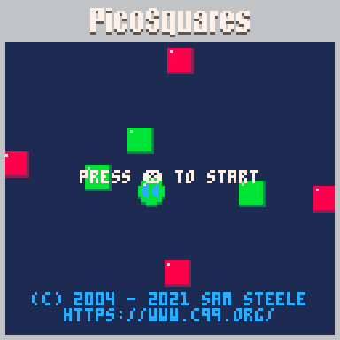
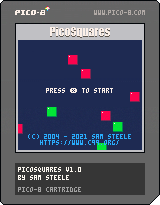

# PicoSquares
A PICO-8 conversion of DCSquares

## About
PicoSquares is a [PICO-8](https://www.lexaloffle.com/pico-8.php) conversion of [DCSquares](https://github.com/c99koder/DCSquares), a homebrew game I released for the SEGA Dreamcast in 2003.  This version of the game is available for Windows, Mac, and Linux.

## How To Play
Collect the green squares and avoid the red ones! The difficulty increases with the more squares you collect.
Special items can help you or hurt you, so choose wisely!

## Download

Windows, Mac, and Linux builds are available on the [Github Releases page](https://github.com/c99koder/DCSquares/releases).
The game can also be played in your [mobile phone's web browser](https://www.c99.org/projects/picosquares_mobile.html).

## License
Copyright (C) 2021 Sam Steele.

This work is licensed under a Creative Commons Attribution-NonCommercial-ShareAlike 4.0 International License

https://creativecommons.org/licenses/by-nc-sa/4.0/